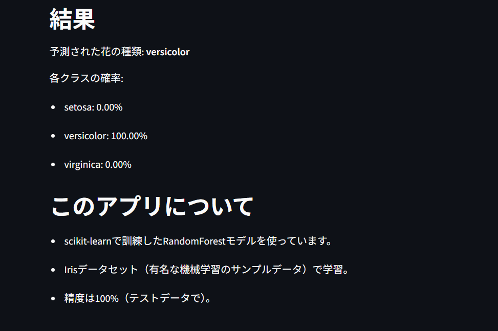

# Iris 花の分類予測アプリ

Streamlitで作ったシンプルなAIアプリ！ 花の特徴（がく片・花びらのサイズ）を入力すると、機械学習モデルがIrisの種類（setosa, versicolor, virginica）を予測します。Python初心者のポートフォリオプロジェクトとして作成しました。
全くの初心者から1週間【構想から実際のコードまで】で完成しました。
## デモ結果例

- **入力例**: がく片長さ 5.0cm、幅 3.0cm、花びら長さ 4.0cm、幅 1.0cm
- **予測結果**: **versicolor** (94% 確率)
  - setosa: 6%
  - versicolor: 94%
  - virginica: 0%

## 機能
- ユーザー入力（スライダー）で花の特徴を調整。
- RandomForestClassifierでリアルタイム予測（確率も表示）。
- モデルの精度評価（テストデータで100%）。

## 実行方法（ローカルで動かす）
1. このリポジトリをクローン:

2. フォルダに移動: `cd iris-prediction-app`
3. ライブラリインストール:

4. アプリ起動:

- ブラウザで `http://localhost:8501` が開きます！

## 技術スタック
| カテゴリ | ツール |
|----------|--------|
| 言語 | Python 3.x |
| 機械学習 | scikit-learn (RandomForestClassifier) |
| Webアプリ | Streamlit |
| データ処理 | NumPy |

## 学びと今後
- **学んだこと**: 機械学習の基本フロー（データ分割、訓練、評価）とStreamlitの簡単なWebアプリ化。エラー修正（NameErrorなど）でデバッグスキルUP！
- **課題**: データセットが小さいので、次は実世界データ（例: 画像認識）で拡張予定。

## ライセンス
MIT License（自由に使ってOK）。

質問やフィードバックがあれば、[Issues](https://github.com/KitayamaRosanjin/iris-prediction-app/issues)からどうぞ！ ⭐ を押して応援お願いします。  
作成者: Kitayama Rosanjin (@GitHubユーザー名)
